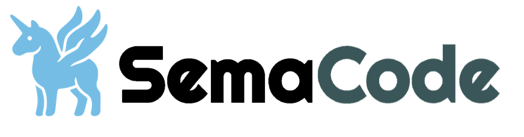

<div align="center">

<picture>
  <source media="(prefers-color-scheme: dark)" srcset="./docs/images/semacode-logo-dark.png">
  <source media="(prefers-color-scheme: light)" srcset="./docs/images/semacode-logo.png">
  
</picture>

<h3>事件驱动型 AI 编程助手核心引擎</h3>

<p>为构建代码助手工具提供可靠、可插拔的智能处理能力</p>

[](https://github.com/midea-ai/sema-code-core/blob/main/LICENSE)
[](https://deepwiki.com/midea-ai/sema-code-core)
[](https://www.npmjs.com/package/sema-core)
[](https://midea-ai.github.io/sema-code-core)
[](https://arxiv.org/abs/2604.11045)

**中文** | [English](./README.md)

</div>

## 📖 项目概述

**Sema Code Core** 是一个事件驱动型 AI 编程助手核心引擎，为构建代码助手工具提供可靠、可插拔的智能处理能力。支持多智能体协同、Skill 扩展、Plan 模式任务规划等核心能力，可快速集成到各类 AI 编程工具中。

[查看文档](https://midea-ai.github.io/sema-code-core)

## ✨ 核心特性

| 特性 | 说明 |
|:-----|:-----|
| **自然语言指令** | 通过自然语言直接驱动编程任务 |
| **权限控制** | 细粒度的权限管理，确保操作安全可控 |
| **Subagent 管理** | 支持多智能体协同工作，可根据任务类型动态调度合适的子代理 |
| **Skill 扩展机制** | 提供插件化架构，可灵活扩展 AI 编程能力 |
| **Plan 模式任务规划** | 支持复杂任务的分解与执行规划 |
| **MCP 协议支持** | 内置 Model Context Protocol 服务，支持工具扩展 |
| **多模型支持** | 兼容 Anthropic、OpenAI SDK，支持国内外主流厂商 LLM API |

## 🎯 适用场景

- **IDE / 编辑器插件开发** — 为编辑器提供底层 AI 能力封装，开发者只需专注 UI 交互，无需自研复杂的大模型调度与工具调用逻辑。

- **企业内部研发工具** — 私有化部署 + 权限管控，适配企业自有模型与安全规范。开箱即用的工具链，避免从零构建 AI 编程基础设施。

- **垂直领域智能工作流** — 将复杂工程任务（迁移、重构、文档）拆解为自动化流程。多智能体协同执行，替代人工处理重复性代码工作。

- **学术研究与 Agent 原型验证** — 为学术机构与独立研究者提供轻量级 Agent 实验环境，支持灵活组合工具链与智能体策略，让研究者聚焦算法创新。

## 💼 使用案例

### VSCode Extension

[Sema Code VSCode Extension](https://github.com/midea-ai/sema-code-vscode-extension) 是基于 Sema Code Core 引擎的 VSCode 智能编程插件。

<p align="center">
  
</p>

### SemaClaw 

[SemaClaw](https://github.com/midea-ai/SemaClaw) 是一个通用的工程框架，用于构建个人 AI 代理。

<p align="center">
  
</p>

### Skill Web App

基于 Sema Code Core 的 Skill 网页应用，集成 Agent Skill Browser / Creator / Playground 演示。

<p align="center">
  
</p>

## 🚀 快速开始

### 1. 新建项目并安装依赖

```bash
mkdir my-app && cd my-app
npm init -y
npm install sema-core
```

### 2. 下载示例文件

将 [quickstart.mjs](https://github.com/midea-ai/sema-code-core/tree/main/example/quickstart.mjs) 下载到 `my-app` 目录，然后修改以下两处配置：

```js
const core = new SemaCore({
  workingDir: '/path/to/your/project', // Agent 将操作的目标代码仓库路径
  ...
});

const modelConfig = {
  apiKey: 'sk-your-api-key', // 替换为你的 API Key
  ...
};
```

更多模型配置参考[模型管理](https://midea-ai.github.io/sema-code-core/#/wiki/getting-started/basic-usage/add-new-model)

### 3. 运行

```bash
node quickstart.mjs
```


跨语言集成参考 [README.md](./example/README.md)

## 🛠️ 开发

```bash
# 1. 安装依赖
npm install

# 2. 编译
npm run build

```

