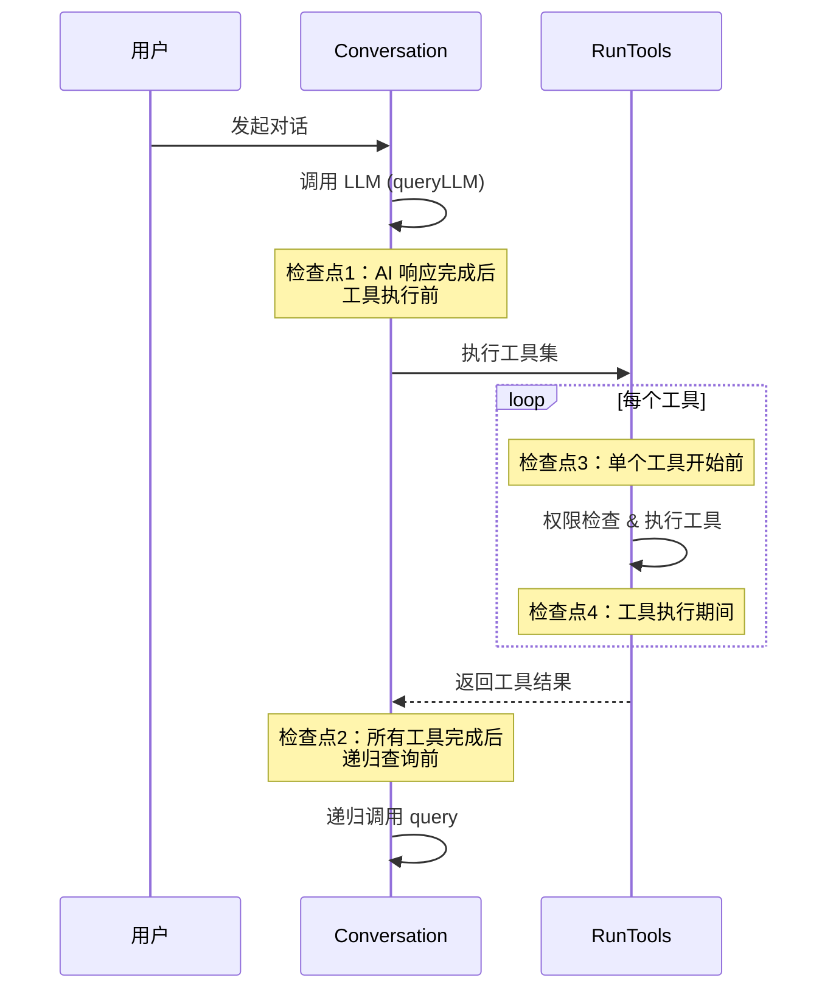

# Conversation — 对话系统

`Conversation` 模块实现了与 LLM 的核心对话循环，是整个 Agent 执行引擎的心脏。其入口为异步生成器 `query()`。

## 核心职责

- 以流式方式调用 LLM API
- 收集并分发 thinking、text、tool_use 响应块
- 决定并执行工具调用（并发或串行）
- 将工具结果反馈给 LLM，递归继续对话
- 处理 4 个中断检查点
- 自动压缩超长上下文（仅主代理）
- 上下文重建（Plan ↔ Agent 模式切换）
- 注入处理中收到的用户消息（inject 队列）
- 处理 `max_tokens` 截断的兜底逻辑


## 入口：SemaEngine 预处理

`query()` 由 `SemaEngine.processQuery()` 调用，调用前已完成：

1. **命令处理**：`handleCommand` 逐条处理输入；系统命令已直接执行并跳过
2. **文件引用解析**：`processFileReferences` 提取 `@文件` / `@目录`，生成 `systemReminders` 与补充信息（触发 `file:reference`）
3. **系统提示词生成**：`formatSystemPrompt` 拼装工作目录、Memory、Rule、Skill 摘要、Plan 模式提示等
4. **additionalReminders 构建**（`buildAdditionalReminders`）：
   - 文件引用 `systemReminders`（每次均添加）
   - 首次查询时：Todos 提醒（仅当工具集中含 Skill 时按内部规则附加）、Rules 提醒
   - Plan 模式首次查询时：Plan 模式专用提醒（发送后标记避免重复）
5. **AgentContext** 构建：`{ agentId, abortController, tools, model: 'main' }`


## query() 主循环

```
query(messages, systemPromptContent, agentContext)
   │
   ▼
1. shouldAutoCompact 检查（仅主代理）
   ├─ 命中 → TaskManager.dispose() + autoCompact + 清空 todos / readFileTimestamps
   ▼
2. queryLLM(...) 流式调用 LLM
   ├─ emit message:thinking:chunk / message:text:chunk
   ├─ 异常处理：
   │   ├─ aborted → 追加 INTERRUPT_MESSAGE 后保存历史 + emit session:interrupted
   │   └─ API 错误 → 仅保存原历史并 flushHistory
   │
   ▼
3. 检查点1（AI 响应完成后、工具执行前）
   └─ aborted → 追加中断消息 + emit session:interrupted + return
   ▼
4. yield assistantMessage
   ▼
5. max_tokens 截断检测
   ├─ 含工具调用 → emit session:error + finalizeMessages + return
   └─ 纯文本 → 仅 emit session:error，继续
   ▼
6. emit message:complete + emit conversation:usage（仅主代理）
   ▼
7. 若无 tool_use → finalizeMessages + return
   ▼
8. 决定执行策略
   ├─ 全部工具 isReadOnly() / canRunConcurrently() → runToolsConcurrently
   └─ 否则 → runToolsSerially
   ▼
9. 检查点2（工具完成、递归前）
   └─ aborted → 在最后一条工具结果末尾追加中断文本 + emit session:interrupted +
                emit conversation:usage + finalizeMessages + return
   ▼
10. 工具结果按 tool_use 顺序排序
   ▼
11. 注入待处理用户消息（仅主代理，injectPendingInputsIntoToolResult）
   ▼
12. handleControlSignalRebuild
   └─ 检测 ExitPlanMode 等的 controlSignal.rebuildContext，
      可重建 tools / systemPrompt / nextMessages
   ▼
13. yield* query(nextMessages, nextSystemPrompt, nextAgentContext)  // 递归
```

> 子代理（subagent，`agentId !== MAIN_AGENT_ID`）跳过自动压缩、跳过 `conversation:usage` 事件，也不会执行 inject 注入。


## 工具执行策略

### 并发执行（runToolsConcurrently）

**条件**：本轮所有工具均满足 `isReadOnly() === true` 或 `canRunConcurrently() === true`

```javascript
const canRunConcurrently = toolUseMessages.every(msg => {
  const tool = tools.find(t => t.name === msg.name)
  return tool?.isReadOnly?.() || tool?.canRunConcurrently?.() || false
})
```

**优势**：显著提升多文件读取、多次搜索等场景的性能

**典型工具**：`Read`、`Glob`、`Grep`

### 串行执行（runToolsSerially）

**条件**：本轮存在任意一个非只读且不可并发的工具

**优势**：避免写操作之间的竞态（例如先 `Write` 后 `Edit` 同一文件）

**典型工具**：`Bash`、`Write`、`Edit`、`TaskCreate`、`TaskUpdate`、`Agent` 等


## 中断机制

执行过程中设有 4 个检查点。`AbortController.signal.aborted` 在不同位置触发不同的善后逻辑：



| 检查点 | 位置 | 触发后行为 |
|--------|------|-----------|
| 0（前置）| `queryLLM` 抛出 | 若 aborted：追加 `INTERRUPT_MESSAGE` 并 finalize；否则仅保存原历史并 `flushHistory()` 后抛出 |
| 1 | AI 响应完成、工具执行前 | emit `session:interrupted`，把 `INTERRUPT_MESSAGE` 作为用户消息追加到历史并 finalize |
| 2 | 所有工具完成、递归查询前 | emit `session:interrupted`，向最后一条工具结果追加 `INTERRUPT_MESSAGE_FOR_TOOL_USE` 文本，发送 `conversation:usage`，finalize |
| 3 | 单个工具开始前 | RunTools 内部返回取消消息（`CANCEL_MESSAGE`） |
| 4 | 工具执行期间 | 拒绝原因为 `refuse` 时保留原消息，否则返回取消消息 |

调用 `sema.interruptSession()` 后，会在最近的检查点中止执行，并触发 `session:interrupted` 事件。后续是否继续消费输入队列、切换会话或置 `idle`，由 `SemaEngine.processQuery.finally` 决定。


## max_tokens 截断处理

当 `assistantMessage.message.stop_reason === 'max_tokens'` 时：

| 情形 | 处理 |
|------|------|
| 含 tool_use 块 | emit `session:error { code: 'API_RESPONSE_ERROR' }`（参数被截断），finalizeMessages 后 return，停止递归 |
| 纯文本 | emit `session:error`（提醒用户调整最大输出 token），但作为正常响应继续后续流程 |


## 上下文压缩（Compact）

每次 `query` 入口都会判断是否需要压缩（仅主代理）：

```
shouldAutoCompact(messages) === true
        │
        ▼
TaskManager.dispose()           // 关闭后台进程，避免压缩后状态不一致
autoCompact(messages, abortCtl) // LLM 摘要式压缩
        │
        ▼
agentState.updateTodosIntelligently([])
agentState.setReadFileTimestamps({})
        │
        ▼
（压缩过程内部 emit compact:exec { tokenBefore, tokenCompact, compactRate }）
```

压缩后对话继续正常进行，对用户透明。子代理跳过此流程。


## 上下文重建（handleControlSignalRebuild）

当任一工具结果携带 `controlSignal.rebuildContext` 时（典型场景：`ExitPlanMode`）：

```javascript
controlSignal: {
  rebuildContext: {
    reason: 'mode_changed'
    newMode: 'Agent' | 'Plan'
    rebuildMessage?: ContentBlockParam[]  // clearContextAndStart 时使用
  }
}
```

重建步骤：

1. 重新获取工具集：`getTools(useTools) + getMCPManager().getMCPTools()`
2. 若 `newMode === 'Plan'` → 过滤掉 `TaskCreate`、`TaskUpdate`
3. 用新 tools 构造 `newAgentContext`
4. 重新生成系统提示词 `formatSystemPrompt()`（不再含 Plan 模式提示）
5. 决定下一轮消息历史：
   - **无 `rebuildMessage`**（startEditing）：保留原历史 → `[...messages, assistantMessage, ...orderedToolResults]`
   - **有 `rebuildMessage`**（clearContextAndStart）：清空历史，新建一条用户消息，附带 Skill / Rules 等首次查询提醒 + `rebuildMessage` 内容

随后 `query` 用新上下文递归继续。


## 用户消息注入（injectPendingInputsIntoToolResult）

主代理在「工具执行完成 → 递归查询」之间，会消费 `StateManager` 的注入队列：

```
1. consumeInjectInputsBeforeNextCommand() —— 从队头连续取 inject 类型，遇 command 停止
2. 对每条 inject 输入：
   - 非 silent → emit input:processing + saveUserInputToHistory
   - processFileReferences（必要时 emit file:reference）
   - 拼接 system-reminder 文本，追加到最后一条工具结果的 content 末尾
```

这样 LLM 在下一轮即可看到「用户在工具执行期间发送的新消息」，并被要求在完成当前任务后立即响应。


## Token 追踪

每轮 AI 响应完成后及检查点 2 中断时均发布 token 使用情况（仅主代理触发）：

```javascript
sema.on('conversation:usage', ({ usage }) => {
  console.log(`已用: ${usage.useTokens} / ${usage.maxTokens}`)
  console.log(`Prompt tokens: ${usage.promptTokens}`)
})
```
