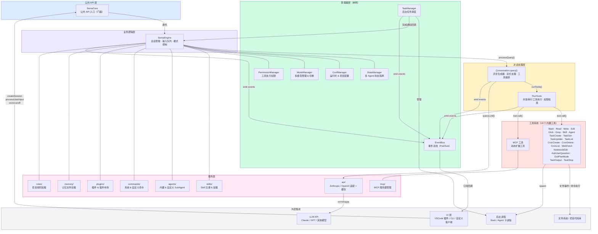

# 架构设计

## 设计原则

Sema Code Core 采用以下核心设计原则：

- **事件驱动**：所有状态变化通过事件总线传播，消费方只需订阅感兴趣的事件
- **模块化分层**：清晰的层次划分，各层职责单一、边界明确
- **可插拔扩展**：工具、模型、Skill、SubAgent、MCP、Plugin、Memory、Rule 均支持动态注册与替换
- **状态隔离**：主 Agent 与 SubAgent 各自维护独立的消息历史和运行状态
- **可中断**：所有耗时操作通过 `AbortController` 与多检查点配合，支持随时中断


## 整体架构




## 目录结构

```
src/
├── core/                   # 核心对话引擎
│   ├── SemaCore.ts         # 公共 API 门面层
│   ├── SemaEngine.ts       # 业务逻辑引擎（输入队列 / 会话切换）
│   ├── Conversation.ts     # AI 对话循环（异步生成器）
│   └── RunTools.ts         # 工具执行（并发/串行策略）
│
├── tools/                  # 工具系统（18 个内置工具）
│   ├── base/
│   │   ├── Tool.ts         # 工具基础接口
│   │   └── tools.ts        # 工具注册表与构建器
│   ├── Bash/               # 终端执行工具（支持后台运行）
│   ├── Glob/               # 文件搜索工具
│   ├── Grep/               # 文本搜索工具
│   ├── Read/               # 文件读取工具
│   ├── Write/              # 文件写入工具
│   ├── Edit/               # 文件编辑工具
│   ├── NotebookEdit/       # Notebook 编辑工具
│   ├── TaskCreate/         # 创建任务工具
│   ├── TaskGet/            # 查询任务工具
│   ├── TaskUpdate/         # 更新任务工具
│   ├── TaskList/           # 任务列表工具
│   ├── CronCreate/         # 创建定时任务工具
│   ├── CronDelete/         # 删除定时任务工具
│   ├── CronList/           # 定时任务列表工具
│   ├── WebFetch/           # 网页抓取工具
│   ├── Agent/              # 子代理工具（原 Task，支持后台运行）
│   ├── Skill/              # Skill 调用工具
│   ├── AskUserQuestion/    # 用户交互工具
│   ├── ExitPlanMode/       # 退出 Plan 模式工具
│   ├── TaskOutput/         # 查看后台任务输出
│   └── TaskStop/           # 停止后台任务
│
├── services/               # 服务层
│   ├── api/                # LLM API 交互
│   ├── mcp/                # MCP 协议集成
│   ├── skills/             # Skill 系统
│   ├── agents/             # SubAgent 管理 + 系统提示词组装
│   ├── commands/           # 系统 & 自定义命令分发
│   ├── plugins/            # 插件 & 插件市场
│   ├── memory/             # 记忆文件加载
│   ├── rules/              # 项目规则加载
│   └── prompt/             # 提示词资源
│
├── manager/                 # 管理器层（单例）
│   ├── StateManager.ts      # 会话状态（按 agentId 隔离）+ 输入队列
│   ├── ConfManager.ts       # 核心配置 + 项目配置
│   ├── ModelManager.ts      # 模型配置与切换
│   ├── PermissionManager.ts # 工具执行权限
│   └── TaskManager.ts       # 后台任务调度（Bash/Agent）
│
├── events/                 # 事件系统
│   ├── EventSystem.ts      # 事件总线（单例）
│   └── types.ts            # 事件类型定义
│
├── types/                   # TypeScript 类型定义
├── util/                    # 工具函数（~36 个文件）
└── constants/               # 配置常量
```

## 数据流

用户输入到响应输出的完整数据流：

```
用户输入
   │
   ▼
SemaCore.processUserInput(input)
   │
   ▼
SemaEngine.processUserInput()
   ├─ /btw 旁路：异步处理后直接返回
   ├─ 若状态为 processing → 入队（command / inject 类型）
   └─ 否则 → startQuery() → processQuery()
          ├─ 解析系统/自定义命令（handleCommand）
          ├─ 后台话题检测（detectTopicInBackground）
          ├─ 解析 @文件引用（processFileReferences）
          ├─ 构建系统提示词（formatSystemPrompt：注入 memory / rule / skill 等）
          ├─ 组装 reminder（todos / files / Plan 模式提示）
          └─ 触发 Conversation.query()
                 │
                 ▼
              调用 LLM API（流式）
                 ├─ emit message:thinking:chunk
                 ├─ emit message:text:chunk
                 └─ 收集 tool_use 块
                        │
                        ▼
                  执行工具（RunTools）
                  ├─ 只读工具 → 并发执行
                  └─ 写入工具 → 串行执行
                        │
                        ├─ emit tool:permission:request（需授权时）
                        ├─ emit tool:execution:chunk（流式中间态）
                        ├─ emit tool:execution:complete
                        └─ 工具结果 → 返回 LLM
                               │
                               ▼
                          继续对话循环...
                               │
                               ▼（无工具调用时结束）
                          emit message:complete
                          emit state:update { state: 'idle' }
   │
   ▼
processQuery.finally()
   ├─ 优先处理 pendingSession（会话切换）
   └─ 否则消费输入队列中的下一批（takeNextBatch）
```

## 核心模块说明

### SemaCore — 公共 API 层

对外暴露的唯一入口，采用外观（Facade）模式：
- 封装内部复杂度，提供简洁的 API
- 代理事件系统（on / once / off）
- 处理用户响应（工具权限、提问、Plan 退出）
- 提供模型、配置、MCP、Skill、Agent、Command、Memory、Rule、插件市场、后台任务等管理 API
- `dispose()` 统一清理所有单例资源

### SemaEngine — 引擎层

核心业务逻辑的调度中心：
- 维护 `pendingSession` 与 `currentProcessingPromise`，实现会话切换的等待与覆盖
- 维护 `PendingUserInput` 队列：处理中收到的输入按 `command`/`inject` 类型入队，处理完成后由 finally 自动消费
- `/btw` 旁路问答：不影响主流程状态
- 注入 `TaskManager` 后台通知回调，将后台任务完成通知作为 `silent` 输入注入主对话
- 根据 `agentMode`（Agent / Plan）动态组装工具集
- 处理文件引用、系统提示词构建

### Conversation — 对话系统

基于异步生成器的 AI 对话循环：
- 流式接收 LLM 响应
- 智能选择工具执行策略（并发 / 串行）
- 多检查点的中断机制（基于 `AbortController.signal`）
- 自动压缩超长上下文（compact）
- 处理上下文重建信号（Plan 模式退出）

### Manager Layer — 管理器层

五个单例管理器，负责不同维度的状态：

| 管理器 | 职责 | 持久化路径 |
|--------|------|-----------|
| StateManager | 会话状态、消息历史、Todos、输入队列 | `~/.sema/history/<project>/` |
| ConfManager | 核心配置、项目配置 | `~/.sema/projects.conf` |
| ModelManager | 模型配置与切换 | `~/.sema/model.conf` |
| PermissionManager | 工具执行权限检查 | 项目配置中的 `allowedTools` |
| TaskManager | 后台任务调度（Bash/Agent） | `~/.sema/tasks/`（任务输出文件） |

### Event System — 事件系统

基于发布-订阅模式的单例事件总线：
- 解耦各模块间的依赖
- 支持流式 UI 更新
- 所有外部状态变化均通过事件通知
- 涵盖会话生命周期、AI 消息、工具执行、子代理、后台任务、Plan 模式、提问交互、上下文统计、MCP 状态、BTW 旁路等

## 扩展机制

| 扩展类型 | 扩展方式 | 存放位置 |
|---------|---------|---------|
| MCP 工具 | `addMCPServer()` API 或编辑 MCP 配置 | 用户级 / 项目级 MCP 配置 |
| Skill | 创建 SKILL.md | `~/.sema/skills/` 或 `.sema/skills/` |
| SubAgent | 创建 Agent 配置 `.md` | `~/.sema/agents/` 或 `.sema/agents/` |
| 自定义命令 | 创建命令 `.md` | `~/.sema/commands/` 或 `.sema/commands/` |
| 自定义模型 | `addModel()` API | `~/.sema/model.conf` |
| 插件市场 | `addMarketplaceFromGit()` / `addMarketplaceFromDirectory()` API | 由 PluginsManager 管理 |
| Memory | CLAUDE.md 等记忆文件 | 由 MemoryManager 自动加载 |
| Rule | 项目规则文件 | 由 RuleManager 自动加载 |

## 关键运行时特性

- **可中断**：`AbortController` 在 `processQuery` 多个早期检查点验证，确保会话切换或用户中断后立即返回
- **会话切换**：新 `createSession` 在处理中时会等待旧会话结束（最多 10 秒），由 `pendingSession` + finally 链路完成切换
- **输入队列**：`command` 类输入立即单独成批，`inject` 类输入合并成批，由 `takeNextBatch` 控制
- **后台任务**：`Bash` 与 `Agent` 通过 `run_in_background` 进入后台，由 `TaskManager` 管理；可通过 `disableBackgroundTasks` 配置在 schema 层面禁用
- **前后台转换**：`transferAgentToBackground` 支持将运行中的前台 Agent 转为后台执行
